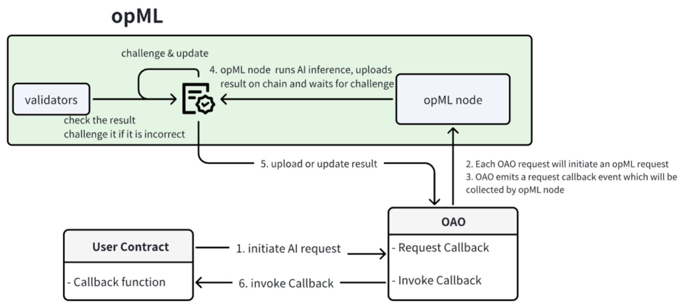

# OAO: Onchain AI Oracle

> OAO (onchain AI oracle), powered by [opML](https://github.com/hyperoracle/opml) (optimistic machine learning) on Ethereum, brings ML model onchain.

## Architecture and Workflow

The specific architecture of OAO is as follows. The user's contract can initiate an AI request by calling OAO, OAO will publish the request to opML node for processing, and then OAO will return the AI result to the user.



In terms of workflow, we need to break down the explanation into two parts.

Usage process:

1. The user contract sends the AI request to OAO on chain, by calling `requestCallback` function on the OAO contract.
2. Each AI request will initiate an opML request.
3. OAO will emit a `requestCallback` event which will be collected by opML node.
4. opML node will run the AI inference, and then upload the result on chain.
    
    Challenge process:
    
    1. The challenge window starts right after step 4 in previous section.
    2. During the challenge period, the opML validators (or anyone) will be able to check the result and challenge it if the submitted result is incorrect.
    3. If the submitted result is successfully challenged by one of the validators, the submitted result will be updated on chain.
    4. After the challenge period, the submitted result on chain is finalized (results can not be mutated).
5. When the result is uploaded or updated on chain, the provided result in opML will be dispatched to the user's smart contract via its specific callback function.

## Deployment

Here are the OAO contracts deployed onchain:

**ETH Sepolia**

| contract | Sepolia Address |
|--|--|
| OAO    | 0x0A0f4321214BB6C7811dD8a71cF587bdaF03f0A0 |  
| prompt | 0xe75af5294f4CB4a8423ef8260595a54298c7a2FB |
| SimplePrompt | 0x696c83111a49eBb94267ecf4DDF6E220D5A80129 |

**ETH Mainnet**

| contract | Mainnet Address |
|--|--|
| OAO    | 0x0A0f4321214BB6C7811dD8a71cF587bdaF03f0A0 |  
| prompt | 0xb880D47D3894D99157B52A7F869aB3B1E2D4349d |
| SimplePrompt | 0x61423153f111BCFB28dd264aBA8d9b5C452228D2 | 

**Optimism Sepolia**

| contract/EOA | Sepolia Address |
|--|--|
| OAO    | 0x0A0f4321214BB6C7811dD8a71cF587bdaF03f0A0 |  
| prompt | 0x3c8Cd1714AC9c380702D160BE4cee0D291Eb89C0 |
| SimplePrompt | 0xf6919ebb1bFdD282c4edc386bFE3Dea1a1D8AC16 | 

**Optimism Mainnet**

| contract/EOA | Mainnet Address |
|--|--|
| OAO    | 0x0A0f4321214BB6C7811dD8a71cF587bdaF03f0A0 |  
| prompt | 0xC3287BDEF03b925A7C7f54791EDADCD88e632CcD |
| SimplePrompt | 0xBC24514E541d5CBAAC1DD155187A171a593e5CF6 | 

Currently, you can use the onchain ML model by initiating an onchain transaction by interacting with Prompt contract. We have uploaded two models to OAO.

| modelID | model| 
| -- | -- |
| 11 | llama |
| 50 | Stable Diffusion (SD) |

## Usage

1. Inherit `AIOracleCallbackReceiver`  in your contract and bind with a specific OAO address:
    ```solidity
    constructor(IAIOracle _aiOracle) AIOracleCallbackReceiver(_aiOracle) {}
    ```
2. Write your callback function to handle the AI result from OAO. Note that only OAO can call this function:
    ```solidity
    function aiOracleCallback(uint256 requestId, bytes calldata output, bytes calldata callbackData) external override onlyAIOracleCallback()
    ```
3. When you want to initiate an AI inference request, call OAO as follows:
    ```solidity
    aiOracle.requestCallback(modelId, input, address(this), gas_limit, callbackData);
    ```
